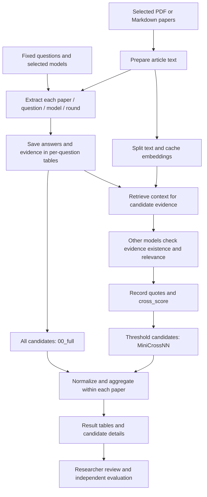
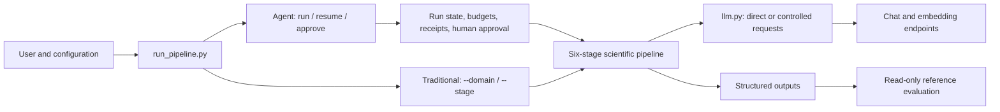
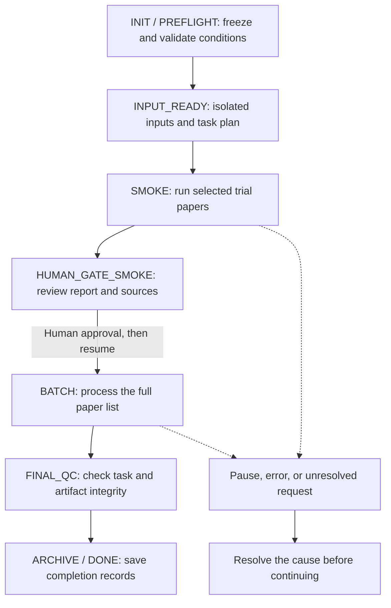

# LUMINA

**English** | [简体中文](README.zh-CN.md)

[](https://github.com/Voss-zeji/LUMINA/actions/workflows/mock-tests.yml)
[](LICENSE)

LUMINA extracts structured scientific information from academic papers using multiple language models. This Voss fork adds persistent run control, API budgets, recovery, human approval, and independent reference evaluation.

The name expands to **Language-model Unified Meta-analysis with Integrated Numeric Assembly**. The current code prepares literature evidence tables; it does **not** implement statistical meta-analysis.

## 1. What the project does

LUMINA is intended for researchers who have selected their papers and defined the information they need. It reads each paper with several models, retains answers and supporting evidence, asks other models to check the evidence, and organizes the candidates into tables for review.

| Implemented | Outside the current implementation |
|---|---|
| Fixed Aqua and Wildfire question sets | Automatic research-question or extraction-schema generation |
| PDF/Markdown preparation and per-question extraction | Literature search, study screening, or a complete systematic-review protocol |
| Evidence retrieval and cross-model checking | Strict validation of every value, unit, and experimental condition |
| Traceable files and rule-based candidate aggregation | Effect-size calculation, statistical pooling, or bias assessment |
| Agent run control and a read-only reference evaluator | Web UI, HTTP API server, or Docker deployment |

Researchers remain responsible for study selection, scientific definitions, reference preparation, and acceptance of the final data.

## 2. Supported research tasks

Questions are defined in [`lumina/prompts.py`](lumina/prompts.py). Changing the configured domain description does not generate new questions. Custom or partial question selection is currently unsupported.

| Domain | Question | Extracted information |
|---|---|---|
| **Aqua**: freshwater aquaculture | Q1 | Study location, location details, study period, latitude, longitude |
| | Q2 | Cultured species: fish, shrimp, crab, mixed, or others |
| | Q3 | Methane flux values for comparative tests or treatments, with units |
| **Wildfire**: biomass burning | Q1 | Study location and study period |
| | Q2–Q4 | CO2, CH4, and N2O emission factors by fuel/combustion condition, with evidence, MCE, and `experimental` markers |

Aqua numeric prompts request a separate `unit` field. Wildfire prompts describe emission-factor units but do not require that separate field. Wildfire's `experimental` marker distinguishes experimental/reference sources; it is not a reliable unique experiment ID.

## 3. Scientific workflow



| Stage | What happens | Main output |
|---|---|---|
| `prepare` | Convert PDFs with optional Marker; read Markdown; retain text before References/Acknowledgments/Appendix; audit approximate tokens | Markdown and preparation information |
| `examiner` | Send the article body and one fixed question to each selected model | Per-task answer tables and metadata |
| `composite` | Collect current models' answers for the selected round, retaining provenance | One Excel candidate table per question |
| `embeddings` | Split article text into overlapping chunks and embed them | `.npy` vectors and cache metadata |
| `cross` | Retrieve the most similar chunk and adjacent chunks; ask other models whether evidence is present and relevant | Verification records, quotes, and scores |
| `ensemble` | Normalize and aggregate unfiltered and configured threshold variants | Result and all-standardized-answer Excel tables |

Extraction receives the whole retained article body in three messages: expert role, article/output instructions, and the question. Verification receives local retrieved context and the candidate's `evidence`, rather than a complete value–unit–condition assertion.

The source model does not verify its own candidate. Other selected models return `existing_flag` (0/1) and `direct_quote`. `cross_score` counts positive votes, with a maximum of **M − 1** for M extraction models. It measures evidence support, not scientific accuracy.

Default retrieval uses 2,048-character chunks, 20% overlap, and one neighboring chunk on each side of the best match. These settings are configurable in `RUN`.

## 4. Traditional and Agent execution

Both modes use the same scientific pipeline. Agent mode adds execution controls without replacing the questions or aggregation algorithms.

| | Traditional mode | Agent mode |
|---|---|---|
| Entry | `--domain` / `--stage` | `run` / `resume` and control commands |
| Inputs | Domain directories in `config.py` | Explicit paper list copied into an isolated run |
| Progress | Stage files and task fingerprints | SQLite state, task records, and request receipts |
| Costs and recovery | No Agent budget ledger | Frozen budgets, durable responses, and unknown-request handling |
| Human approval | No enforced trial-to-batch approval | Trial, report review, then explicit approval |
| Outputs | Configured directories | `runs/<run_id>/outputs/R<round>/` and JSON reports |





Review the trial report before approving batch processing: compare sampled answers with source papers, check units and treatment identity, and inspect failures, missing values, and costs. Even a single-paper run reaches this approval point.

Batch execution reuses completed trial requests. Rounds are saved and aggregated separately; there is no cross-round combined estimate. `ARCHIVE` is a workflow state, not an upload or publication step.

## 5. Install and configure

Use **Python 3.12**, tested by the Windows/Linux CI. Use an isolated Python environment and install the existing dependencies:

```bash
git clone https://github.com/Voss-zeji/LUMINA.git
cd LUMINA
python -m pip install -r requirements.txt
```

Markdown input does not require a PDF converter. For PDFs, separately install a compatible `marker-pdf` release exposing `PdfConverter`, `create_model_dict`, and `text_from_rendered`. PDF conversion may require model resources; the Agent specification must explicitly allow them with `allow_pdf_resources: true`.

Create your local configuration:

**PowerShell**

```powershell
Copy-Item config.example.py config.py
```

**Bash**

```bash
cp config.example.py config.py
```

Edit the copied configuration:

| Setting | What to provide |
|---|---|
| `FULL_LLM_POOL` / `SELECTED_KEYS` | Full model IDs, provider sources, and extraction-model selection |
| `LLM_SETTINGS` | API keys, chat base URLs, and `supports_json_mode` |
| `EMBEDDING_MODEL` | Embedding model/source and complete embedding request URL; falls back to its provider URL |
| `RUN` | Round, temperature, chunk size/overlap, context extension, cross-score thresholds |
| `DOMAINS` | Domain description, fixed question indices, traditional input/output directories |

Chat uses OpenAI-compatible `chat.completions`; embeddings use a direct HTTP POST. Native provider SDK adapters and automatic model/provider fallback are not implemented. Set `supports_json_mode=False` if a provider rejects `response_format`.

JSON mode requests a JSON object, not a full enforced JSON Schema. JSON5 parsing and local field checks provide partial output validation. Keep keys in local `config.py`, which is excluded from Git.

For filtered results, select at least two extraction models. Each `min_cross_scores` entry must be an integer from 1 to M − 1; the two-model example uses `[1]`.

## 6. Run a task

### Agent mode

Copy [`research.example.json`](research.example.json) to `research.json`. Fill in actual paper paths, model prices and their sources, input/output bounds, and the four budgets: `max_calls`, `max_tokens`, `max_cost`, `max_runtime`.

The `null`/`REPLACE` entries are intentional placeholders and must be completed. Model names are examples, not availability guarantees. The trial defaults to the first `smoke_size` papers; `smoke_papers` can select them explicitly. The diagnostic advisor is disabled by default.

Create a plan without model requests:

```bash
python run_pipeline.py run --spec research.json --config config.py --runs-dir runs --run-id study-001 --dry-run
python run_pipeline.py status --runs-dir runs --run-id study-001
```

Dry-run copies inputs, freezes conditions, and plans tasks at `INPUT_READY`. It does not perform PDF conversion or extraction. Start the trial:

```bash
python run_pipeline.py resume --runs-dir runs --run-id study-001 --config config.py
```

Inspect `reports/smoke_report.json` and the source papers. Obtain the pending gate ID from `status`, and replace `GATE_ID` below:

```bash
python run_pipeline.py approve --runs-dir runs --run-id study-001 --gate-id GATE_ID --reason "Reviewed trial outputs and approved the frozen batch scope"
python run_pipeline.py resume --runs-dir runs --run-id study-001 --config config.py
python run_pipeline.py report --runs-dir runs --run-id study-001
```

`approve` records a decision; `resume` continues execution. Exit code **2** means paused or awaiting human attention, **1** indicates an error, and **0** successful completion of the command. An existing run ID cannot be silently overwritten.

The CLI supervises a worker against `max_runtime`, measured **since run creation**, including waiting, pauses, and human review. A pause stops subsequent requests; it does not cancel an already dispatched remote request. Approving a gate cannot enlarge budgets or change frozen scientific conditions.

Agent requests reserve budget before dispatch and save responses before parsing. Missing usage retains a conservative hold. Uncertain execution requires reconciliation rather than blind retry. Only identifiable non-execution rejections are eligible for bounded retry; SDK hidden retries are disabled. See the [Agent guide](AGENT_GUIDE.md) for commands and recovery.

### Traditional mode

Place PDFs or Markdown in the configured domain directories:

```bash
python run_pipeline.py --config config.py --domain aqua --stage all
python run_pipeline.py --config config.py --domain wildfire --stage all
# A single stage, using the required preceding outputs:
python run_pipeline.py --config config.py --domain wildfire --stage ensemble
```

Stages are `prepare`, `examiner`, `composite`, `embeddings`, `cross`, `ensemble`, and `all`. Traditional mode checks file provenance and supports resume, but has no Agent budget accounting or enforced trial approval. A hard interruption can leave its domain lock; confirm the recorded PID before removing it.

## 7. Inputs, results, and traceability

An extraction task is **paper × question × model × round**. One response can contain multiple items. Each has `value`, `evidence`, and `confidence_lv`, plus domain fields. The program adds paper/model/question/round identities, request/body fingerprints, token usage, and elapsed time. Composite tables add `candidate_id`; verification adds flags and `cross_score`.

Files named `.csv` are **tab-separated**. Token totals repeated across answer rows belong to the same request; summing them can overcount usage. Use the Agent request ledger for global accounting.

```text
runs/<run_id>/
  manifest.json                 Frozen inputs and execution conditions
  ledger.sqlite                 Authoritative state, tasks, requests, and gates
  inputs/                       Original paper snapshots
  outputs/
    prepared/                   Markdown and preparation metadata
    R01/
      examiner/                 Per-task TSV answers and metadata
      composite/                LUMINA_Q01.xlsx, LUMINA_Q02.xlsx, ...
      embeddings/               Chunk vectors and cache metadata
      cross/                    Verification records and cross_scores.xlsx
      ensemble/
        00_full/                Unfiltered results and candidate details
        MiniCross01/            Configured threshold variant
  checkpoints/                  Raw responses and stage integrity records
  reports/                      Plan, trial, final, and status JSON reports
  state.json / metrics.json     Exported state and metrics
  events.jsonl / errors.jsonl    Exported events and errors
```

Each question/variant produces `Ensemble_Result` and `Ensemble_All-Standard-Answers` Excel files. Full uses all candidates; filtered variants require completed current verification for evidence-eligible candidates. An empty filtered table is possible. Missing verification is not a negative vote.

Aggregation normalizes metadata, numbers, and unit strings within each paper. It does not convert physical units or statistically pool studies. Numeric `±` expressions retain the center. When at least half of valid normalized numbers have two or more decimal places, the existing cross-item mode retains a candidate set, not a guaranteed single winner. Vote counts can count candidate rows rather than distinct models or studies.

Inspect evidence in composite/verification tables and raw receipts. Input hashes, response receipts, artifact checks, and embedding caches support traceability and restart. Changed frozen inputs or code require a new run. These hashes do not freeze dependencies, provider model versions, or PDF model weights.

## 8. Scientific reliability and current limits

Engineering completion, model agreement, and scientific acceptance are separate. **`DONE` and a passed final QC do not establish correctness**; valid all-empty answers can complete the workflow.

- **Evidence checking:** existence and relevance do not validate a numeric assertion. Positive votes require a nonempty quote, but no mechanical source-substring check is implemented.
- **Field checks:** some missing metadata, unsupported species labels, and nonnumeric strings can pass validation. Confidence is model-reported and uncalibrated.
- **Experiment identity:** aggregation does not fully preserve treatment identity. Aqua's schema does not require `experimental`, while numeric evaluation derives identity from it; absent identity causes `UNMATCHED`. Wildfire's `True`/`Ref` markers are also insufficient as unique IDs.
- **Numeric policies:** exact `-1` is currently treated as missing by numeric aggregation. Unknown/mixed combustion suffixes can merge; decimal-based aggregation can combine items. Unit normalization is not a complete physical-unit validator.
- **Source coverage:** appendix truncation, PDF/table conversion, image-only values, article context limits, and local retrieval can omit information.
- **Reference metrics:** missing/incomparable predictions can be excluded from recall; predictions outside a partial reference may count as false positives. Report comparability and unresolved cases alongside metrics. Protocol labels do not prove independent human review.

Run independent evaluation with a reference prepared outside the extraction process:

```bash
python run_pipeline.py evaluate --runs-dir runs --run-id study-001 --gold independent-gold.json --output-dir evaluation-study-001
```

Evaluation output must be outside the production run directory. [`gold.example.json`](gold.example.json) uses synthetic values to demonstrate the format. Without `--gold`, evaluation reports `NOT_EVALUATED` and null metrics. Synthetic references and mocked tests do not establish real-paper accuracy.

## 9. What Voss fork adds

This fork builds on [billy31/LUMINA](https://github.com/billy31/LUMINA). Earlier engineering/data safeguards were merged upstream before the fork's Agent work.

| Retained scientific core | Added in the Voss fork |
|---|---|
| Fixed questions, prompts, evidence-support criterion | Frozen specifications, input snapshots, stable task identities |
| Metadata/numeric aggregation and threshold variants | SQLite run state, budgets, durable responses |
| Existing provenance, unit, and file-write safeguards | Trial approval, pause/resume, CLI worker supervision |
| Traditional CLI | Reports, explicit task import, restricted optional advisor |
| | Read-only reference evaluation and Windows/Linux offline CI |

Core call sites gained optional runtime hooks. Prompts and aggregation policies were not redesigned; existing scientific limitations remain. The advisor cannot change scientific values, models, prompts, thresholds, budgets, or approve human gates.

## 10. Documentation and code

| Document | Purpose |
|---|---|
| [Agent guide](AGENT_GUIDE.md) (Chinese) | Specifications, commands, budgets, gates, and recovery |
| [Workflow description](LUMINA_AGENTIC_WORKFLOW.md) (Chinese) | Scientific pipeline and implemented controls |
| [Plan and goals](LUMINA_AGENTIC_PLAN_AND_GOALS.md) (Chinese) | Delivery evidence and outstanding real-paper acceptance |
| [Agent review](AGENT_REVIEW.md) / [validation receipt](AGENT_VALIDATION.json) | Historical software verification |
| [Earlier repair report](FIX_REPORT.md) | Pre-fork engineering/data repairs |

Software delivery is recorded as complete; real-paper scientific acceptance remains outstanding. Historical receipts apply to their recorded versions, not every later state.

Main code: [`run_pipeline.py`](run_pipeline.py) (entry), [`preparation`](lumina/preparation.py) (papers), [`prompts`](lumina/prompts.py)/[`examiner`](lumina/examiner.py) (extraction), [`llm`](lumina/llm.py) (transport), [`composite`](lumina/composite.py)/[`cross_validation`](lumina/cross_validation.py)/[`ensemble`](lumina/ensemble.py) (candidate processing), [`agent`](lumina/agent) (run control), and [`evaluation`](lumina/evaluation.py) (reference comparison).

## 11. Verification and license

From the repository root, enable the network guard before running tests:

**PowerShell**

```powershell
$env:LUMINA_TEST_OFFLINE = "1"
$env:PYTHONPATH = "tests"
python -B -m unittest discover -s tests -v
```

**Bash**

```bash
LUMINA_TEST_OFFLINE=1 PYTHONPATH=tests python -B -m unittest discover -s tests -v
```

The audited software has 365 tests covering pipeline regressions, files, SQLite, budgets, process control, reports, and evaluation. [CI](.github/workflows/mock-tests.yml) uses Python 3.12 on Windows/Linux and runs basic Ruff checks. External model/PDF boundaries are mocked; these tests do not establish real-provider compatibility or scientific accuracy.

LUMINA is distributed under [Apache License 2.0](LICENSE). The upstream project and its license are retained.

---

**English** | [简体中文](README.zh-CN.md)
