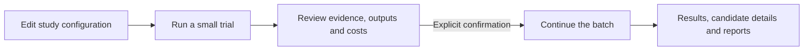

# LUMINA

**English** | [简体中文](README.zh-CN.md)

[](https://github.com/Voss-zeji/LUMINA/actions/workflows/mock-tests.yml)
[](LICENSE)

**LLM Unified Model Integration for Nullifying AI Hallucination**

LUMINA is a multi-model framework for quantitative scientific synthesis. It combines structured literature extraction, cross-examination of supporting evidence, and consensus confirmation to reduce ungrounded model outputs and produce traceable research datasets.

This repository provides a configurable extraction, cross-examination, and consensus pipeline. Aqua and Wildfire are included studies; new text or numeric research topics can be defined in configuration.

## 1. Scientific purpose

Scientific synthesis requires extracting values together with their units, study settings, and experimental context. LUMINA organizes that work around **paper × question × model × round**. Each model returns candidate answers and supporting text; other models check the evidence before the candidates are aggregated.

The resulting tables retain the connection between a scientific variable, its source paper, the model response, and the verification records. Researchers can use them for evidence review, database construction, and subsequent quantitative analysis.

## 2. Scientific framework

The manuscript describes three stages:

| Stage | Operation | Result |
|---|---|---|
| **Initial Query** | Multiple baseline models independently read a paper and answer defined research questions | Candidate values, source evidence, and model-reported confidence |
| **Cross-examination** | Other selected models check the cited evidence against retrieved passages from the paper | Verification decisions and supporting quotations |
| **Consensus Confirmation** | Require both evidence verification and baseline-model consensus; accept the unique most frequent verified value | Structured research records and candidate details |


Extraction uses the complete retained article body. Retrieval is used to locate evidence for cross-examination: the candidate evidence is embedded, matched to article chunks, and supplied to verifying models with neighboring context.

The repository's verifier checks evidence existence and topical relevance. The generating model is excluded from its own verification. For M selected extraction models, `cross_score` counts positive votes from the other models, with a maximum of **M − 1**. `min_cross_scores` sets the verification thresholds; `ensemble` normalizes and aggregates the corresponding candidates.

Consensus Confirmation accepts a record only when **both** conditions hold: its supporting candidates reach the verification threshold (`min_cross_scores`, T_vfy), and their shared normalized answer is the unique most frequent verified value, supported by at least `min_consensus_models` distinct generating models (T_bsl). Repeated rows from one model count once. Different target items, units, and explicit experiment markers are kept separate; tied modes are not accepted. `MiniCrossNN` contains accepted records and candidate gate decisions; `00_full` is an unfiltered diagnostic baseline, not an accepted dataset.

## 3. Research tasks and study examples

The accompanying study evaluates greenhouse-gas evidence extraction using **38 papers and 633 benchmark query–response pairs**, comparing 24 individual LLMs and 17 domain specialists. Seven selected models form the ensemble used in the main study.

Replication cases examine three soil-invertebrate targets—termite effects on plant biomass, earthworm effects on glucosidase activity, and ant effects on soil electrical conductivity—and survival in the marine animal forest biome. Extracted data are supplied to the original studies' analytical workflows.

These study settings describe the manuscript's experiments. In this repository, users select their models and run the following domain question sets:

| Domain | Questions | Extracted information |
|---|---|---|
| **Aqua — freshwater aquaculture** | Q1 | Study location, location details, study period, latitude, longitude |
| | Q2 | Cultured species: fish, shrimp, crab, mixed, or others |
| | Q3 | Methane flux values for comparative tests or treatments, with units |
| **Wildfire — biomass burning** | Q1 | Study location and study period |
| | Q2–Q4 | CO2, CH4, and N2O emission factors, fuel/combustion conditions, MCE, and experimental/reference-source markers |

Question definitions and output instructions are in the [Aqua](configs/aqua/questions.toml) and [Wildfire](configs/wildfire/questions.toml) configurations.

## 4. Program workflow

The scientific framework is implemented through six processing stages:

| Scientific step | Program stage | Processing | Output |
|---|---|---|---|
| Input preparation | `prepare` | Convert PDFs to Markdown with Marker, prepare article text, and inspect approximate token counts | Markdown and preparation information |
| Initial Query | `examiner` | Build the paper/question prompts, invoke selected models, and parse structured responses | Per-task answer tables and metadata |
| | `composite` | Combine the selected models' answers for the current round | Per-question Excel candidate tables |
| Cross-examination | `embeddings` | Split article text into overlapping chunks and generate embeddings | Cached vectors and metadata |
| | `cross` | Retrieve evidence context, invoke other verifying models, and aggregate votes | Verification records and `cross_score` |
| Consensus Confirmation | `ensemble` | Normalize answers and aggregate full and threshold-filtered variants | Result tables and all-standardized-answer tables |

Saved Markdown is preserved; downstream reads use the text before References, Acknowledgments, or Appendix headings. Default retrieval uses 2,048-character chunks, 20% overlap, and one neighboring chunk on each side of the best match.

### Study workflow



Input snapshots, request receipts, budgets, and recovery remain part of the runtime. The batch reuses completed trial requests. Machine completion remains separate from independent scientific evaluation.

## 5. Installation and configuration

Use Python 3.12:

```bash
git clone https://github.com/Voss-zeji/LUMINA.git
cd LUMINA
python install.py --venv .venv
```

`install.py` creates or reuses the specified Python 3.12 venv and installs runtime dependencies, default `marker-pdf`, and fallback `pypdf` into it. Any venv path can be selected, for example `python install.py --venv "/path/to/lumina-env"`. With your own venv activated, `python install.py` uses that environment. Nonempty directories that are not venvs are refused.

Activate the installed environment before the remaining `python` commands:

```powershell
# Windows PowerShell; replace .venv for a custom path
.\.venv\Scripts\Activate.ps1
```

```bash
# Linux / macOS
source .venv/bin/activate
```

Alternatively, use the exact interpreter command printed by the installer. If Marker installation or import fails, setup clearly reports the pypdf fallback. `--skip-marker` installs only the lightweight dependencies. It does not remove an existing Marker installation; set `pdf.backend = "pypdf"` below to force text-only conversion.

PDF is the default input. The prepare stage creates Markdown automatically. Marker may download OCR/layout weights on first use; the example's `allow_pdf_resources = true` explicitly permits that. Package installation alone does not prefetch weights or call scientific-model APIs. First-use model preparation counts toward `max_runtime`; budget time for it or prepare the resources beforehand.

Copy `configs/aqua`, `configs/wildfire`, or `configs/generic` into your study directory:

```bash
cp -R configs/aqua configs/my-study
cp configs/my-study/secrets.example.toml configs/my-study/secrets.local.toml
```

PowerShell:

```powershell
Copy-Item configs/aqua configs/my-study -Recurse
Copy-Item configs/my-study/secrets.example.toml configs/my-study/secrets.local.toml
```

| File | User-editable inputs |
|---|---|
| `project.toml` | Models/endpoints, study identity, rounds, retrieval settings, trial size, output location, prices and four budgets |
| `papers.txt` | One source PDF path per line; existing Markdown remains supported |
| `questions.toml` | All prompts, question definitions, text/numeric types, item and unit rules |
| `secrets.local.toml` | API keys; excluded from Git |

Relative paths resolve from the configuration directory. Replace placeholders with your actual settings, including documented model prices. TOML is read with Python's standard-library `tomllib`.

PDF conversion is configured in `project.toml`:

```toml
[pdf]
backend = "marker"
fallback = "pypdf"
```

Use `fallback = "none"` to disable fallback. For `backend = "pypdf"`, set fallback to `"none"`; this mode downloads no OCR models. pypdf extracts the existing text layer and cannot replace OCR: a page with no extractable text stops conversion instead of being silently omitted. The trial report's `preparation` section records the actual converter, version, and fallback status. Review tables and reading order. [Marker documentation](https://github.com/datalab-to/marker) · [pypdf text extraction](https://pypdf.readthedocs.io/en/stable/user/extract-text.html)

A new topic changes question `id`, `prompt`, `kind`, `items`, `allowed_values`, `require_unit`, and `require_experimental` in configuration. Responses retain the scalar `item/value/evidence/confidence_lv` contract, with `unit/experimental` as needed. New algorithms or nested response structures require Python development.

## 6. Running a study

Validate without model requests or creating a run directory:

```bash
python run_pipeline.py --config configs/my-study/project.toml --check
```

Run or resume:

```bash
python run_pipeline.py --config configs/my-study/project.toml
```

The first invocation processes a small trial. Review `smoke_report.json`, output tables, and source evidence, including units and experiment identities. Enter `y` at the terminal to continue the batch. Noninteractive execution pauses at this point; rerun the same command in an interactive terminal to confirm. Internal gate IDs are not part of this workflow.

`project.stage = "all"` is the default. Set `prepare`, `examiner`, `composite`, `embeddings`, or `cross` to run prerequisite stages and pause after that stage; change back to `all` to continue. `ensemble` completes the scientific stages for the current trial or batch scope without bypassing trial approval.

The same `project.run_id` identifies one run. Changed papers, models, prompts, question rules, scientific settings, or budgets require a new run ID; incompatible cached results are rejected. The stage stop position can change. Exit codes are 0 for success, 2 for pause/required confirmation, and 1 for errors.

`max_runtime` includes elapsed waiting and review time from run creation. Requests with unknown outcomes retain their reservations and require reconciliation rather than blind retries. Diagnostics live in `reports/`.

The legacy Python configuration and commands remain supported. See [configuration and migration](CONFIGURATION.md). Historical runs are not rewritten; incompatible runs require their original revision or a new run. [Advanced operations](AGENT_GUIDE.md) cover diagnostics, independent reference evaluation, and request reconciliation.

## 7. Results and data organization

Each answer contains `value`, `evidence`, `confidence_lv`, and its domain fields. Metadata links it to the paper, question, model, round, and request. Composite tables assign a content-based `candidate_id`; cross-examination adds verification flags and scores.

- **Answer files:** per-model, per-question tables; `.csv` files are tab-separated (TSV).
- **Candidate tables:** all model answers with evidence and provenance, organized by question.
- **Verification records:** each verifying model's decision and quotation.
- **Result tables:** `Ensemble_Result` and `Ensemble_All-Standard-Answers` for `00_full` and configured `MiniCrossNN` variants.
- **Run records:** input snapshots, frozen settings, request receipts, budgets, and execution reports.

Aggregation standardizes metadata, numbers, and unit strings within a paper. Inspect both the result and candidate-detail tables when selecting data for further analysis.

```text
runs/<run_id>/
  manifest.json       Inputs, models, questions, and frozen settings
  ledger.sqlite       Tasks, request attempts, budgets, and approval records
  inputs/             Source-paper snapshots
  outputs/
    prepared/         Markdown and preparation metadata
    R01/
      examiner/       Per-task answers
      composite/      Per-question candidate tables
      embeddings/     Vector caches
      cross/          Verification records and scores
      ensemble/       Full and threshold-filtered results
  checkpoints/        Raw responses and stage receipts
  reports/            Plan, trial, final, and status reports
```

## 8. Project resources

- [Aqua study](configs/aqua/project.toml) · [Wildfire study](configs/wildfire/project.toml) · [New-topic template](configs/generic/project.toml)
- [Configuration and migration](CONFIGURATION.md)
- [Advanced operations and diagnostics](AGENT_GUIDE.md)
- [Independent-reference format](gold.example.json)

This Voss fork builds on [billy31/LUMINA](https://github.com/billy31/LUMINA) and retains the [Apache License 2.0](LICENSE).

---

**English** | [简体中文](README.zh-CN.md)
