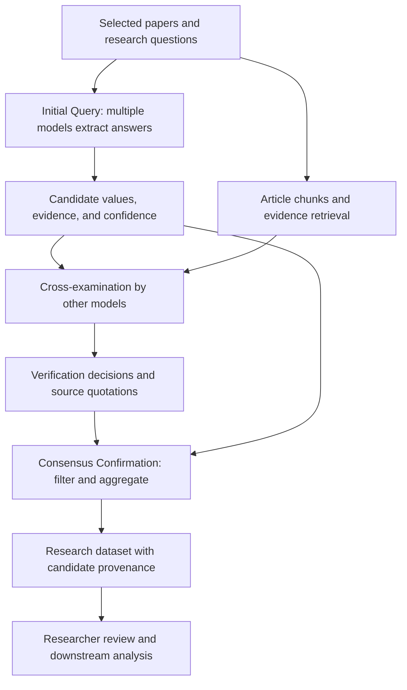
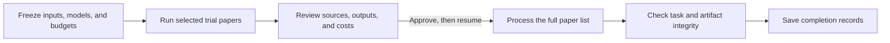

# LUMINA

**English** | [简体中文](README.zh-CN.md)

[](https://github.com/Voss-zeji/LUMINA/actions/workflows/mock-tests.yml)
[](LICENSE)

**LLM Unified Model Integration for Nullifying AI Hallucination**

LUMINA is a multi-model framework for quantitative scientific synthesis. It combines structured literature extraction, cross-examination of supporting evidence, and consensus confirmation to reduce ungrounded model outputs and produce traceable research datasets.

This repository provides the Aqua and Wildfire scientific pipelines together with the Voss Agent execution mode.

## 1. Scientific purpose

Scientific synthesis requires extracting values together with their units, study settings, and experimental context. LUMINA organizes that work around **paper × question × model × round**. Each model returns candidate answers and supporting text; other models check the evidence before the candidates are aggregated.

The resulting tables retain the connection between a scientific variable, its source paper, the model response, and the verification records. Researchers can use them for evidence review, database construction, and subsequent quantitative analysis.

## 2. Scientific framework

The manuscript describes three stages:

| Stage | Operation | Result |
|---|---|---|
| **Initial Query** | Multiple baseline models independently read a paper and answer defined research questions | Candidate values, source evidence, and model-reported confidence |
| **Cross-examination** | Other selected models check the cited evidence against retrieved passages from the paper | Verification decisions and supporting quotations |
| **Consensus Confirmation** | Filter by evidence support and aggregate the verified candidates using cross-model agreement | Structured research records and candidate details |



Extraction uses the complete retained article body. Retrieval is used to locate evidence for cross-examination: the candidate evidence is embedded, matched to article chunks, and supplied to verifying models with neighboring context.

The repository's verifier checks evidence existence and topical relevance. The generating model is excluded from its own verification. For M selected extraction models, `cross_score` counts positive votes from the other models, with a maximum of **M − 1**. `min_cross_scores` sets the verification thresholds; `ensemble` normalizes and aggregates the corresponding candidates.

The manuscript treats evidentiary support and baseline-model agreement as separate controls. The repository records verification scores, candidate frequencies, and model identities so these decisions remain inspectable.

## 3. Research tasks and study examples

The accompanying study evaluates greenhouse-gas evidence extraction using **38 papers and 633 benchmark query–response pairs**, comparing 24 individual LLMs and 17 domain specialists. Seven selected models form the ensemble used in the main study.

Replication cases examine three soil-invertebrate targets—termite effects on plant biomass, earthworm effects on glucosidase activity, and ant effects on soil electrical conductivity—and survival in the marine animal forest biome. Extracted data are supplied to the original studies' analytical workflows.

These study settings describe the manuscript's experiments. In this repository, users select their models and run the following domain question sets:

| Domain | Questions | Extracted information |
|---|---|---|
| **Aqua — freshwater aquaculture** | Q1 | Study location, location details, study period, latitude, longitude |
| | Q2 | Cultured species: fish, shrimp, crab, mixed, or others |
| | Q3 | Methane flux values for comparative tests or treatments, with units |
| **Wildfire — biomass burning** | Q1 | Study location and study period |
| | Q2–Q4 | CO2, CH4, and N2O emission factors, fuel/combustion conditions, MCE, and experimental/reference-source markers |

Question definitions and output instructions are in [`lumina/prompts.py`](lumina/prompts.py).

## 4. Program workflow

The scientific framework is implemented through six processing stages:

| Scientific step | Program stage | Processing | Output |
|---|---|---|---|
| Input preparation | `prepare` | Convert PDFs to Markdown with Marker, prepare article text, and inspect approximate token counts | Markdown and preparation information |
| Initial Query | `examiner` | Build the paper/question prompts, invoke selected models, and parse structured responses | Per-task answer tables and metadata |
| | `composite` | Combine the selected models' answers for the current round | Per-question Excel candidate tables |
| Cross-examination | `embeddings` | Split article text into overlapping chunks and generate embeddings | Cached vectors and metadata |
| | `cross` | Retrieve evidence context, invoke other verifying models, and aggregate votes | Verification records and `cross_score` |
| Consensus Confirmation | `ensemble` | Normalize answers and aggregate full and threshold-filtered variants | Result tables and all-standardized-answer tables |

Saved Markdown is preserved; downstream reads use the text before References, Acknowledgments, or Appendix headings. Default retrieval uses 2,048-character chunks, 20% overlap, and one neighboring chunk on each side of the best match.

### Traditional mode and Agent mode

Both modes call the same scientific pipeline.

| | Traditional mode | Voss Agent mode |
|---|---|---|
| Entry | `--domain` / `--stage` | `run`, `resume`, and control commands |
| Inputs | Domain directories in `config.py` | Explicit paper list and isolated input snapshots |
| Progress | Stage files and task fingerprints | Persistent SQLite state, tasks, and request receipts |
| Execution | Selected stage or the full pipeline | Trial run, human approval, batch processing, final integrity checks |
| Cost records | Request information in outputs | Frozen call/token/cost/runtime budgets and a request ledger |
| Outputs | Configured domain directories | `runs/<run_id>/outputs/R<round>/` and JSON reports |



Agent mode reuses completed trial requests during batch execution. Each round has separate outputs. At the trial approval point, researchers inspect the source evidence, units, treatment assignments, and costs before continuing. Engineering completion is recorded separately from independent scientific evaluation.

## 5. Installation and configuration

Use Python 3.12 and an isolated environment:

```bash
git clone https://github.com/Voss-zeji/LUMINA.git
cd LUMINA
python -m pip install -r requirements.txt
```

For PDF input, install a compatible `marker-pdf` release exposing `PdfConverter`, `create_model_dict`, and `text_from_rendered`. Markdown can be supplied directly.

Copy the configuration template:

```powershell
# PowerShell
Copy-Item config.example.py config.py
```

```bash
# Bash
cp config.example.py config.py
```

| Configuration | Values to set |
|---|---|
| `FULL_LLM_POOL` / `SELECTED_KEYS` | Model IDs, provider sources, and extraction-model selection |
| `LLM_SETTINGS` | API keys, chat base URLs, and `supports_json_mode` |
| `EMBEDDING_MODEL` | Embedding model/source and complete embedding request URL |
| `RUN` | Round, temperature, chunk size/overlap, context extension, and verification thresholds |
| `DOMAINS` | Domain description, question indices, and traditional-mode directories |

Chat uses an OpenAI-compatible `chat.completions` endpoint; embeddings use a direct HTTP POST. `supports_json_mode=True` requests a JSON object, followed by JSON5 parsing and local field validation. Keep credentials in local `config.py`, which is excluded from Git.

For M extraction models, each configured verification threshold must be between 1 and M − 1. The two-model example uses `min_cross_scores: [1]`.

## 6. Running a task

### Traditional pipeline

Place documents in the configured domain directories and run:

```bash
python run_pipeline.py --config config.py --domain aqua --stage all
python run_pipeline.py --config config.py --domain wildfire --stage all
```

Individual stages can be selected after their prerequisite outputs are available:

```bash
python run_pipeline.py --config config.py --domain wildfire --stage ensemble
```

### Agent execution

Copy [`research.example.json`](research.example.json) to `research.json`. Supply paper paths, rounds, trial-paper selection, model prices and their sources, token bounds, and the four budgets: `max_calls`, `max_tokens`, `max_cost`, `max_runtime`. Replace the template's `null` and `REPLACE` entries. For PDF resource preparation, set `allow_pdf_resources: true`.

Create the run and inspect its plan without sending model requests:

```bash
python run_pipeline.py run --spec research.json --config config.py --runs-dir runs --run-id study-001 --dry-run
python run_pipeline.py status --runs-dir runs --run-id study-001
```

Continue the same run to execute the trial:

```bash
python run_pipeline.py resume --runs-dir runs --run-id study-001 --config config.py
```

Review `reports/smoke_report.json` and source papers. Read the pending gate ID from `status`, then replace `GATE_ID`:

```bash
python run_pipeline.py approve --runs-dir runs --run-id study-001 --gate-id GATE_ID --reason "Reviewed trial evidence, outputs, and costs"
python run_pipeline.py resume --runs-dir runs --run-id study-001 --config config.py
python run_pipeline.py report --runs-dir runs --run-id study-001
```

`approve` records the decision; `resume` continues processing. Exit code 2 denotes a pause or required human attention. `max_runtime` measures elapsed time from run creation, including waiting and review. Requests are recorded before parsing, and uncertain execution is retained for reconciliation. See the [Agent guide](AGENT_GUIDE.md) for pause, recovery, and request controls.

For comparison with an independently prepared reference:

```bash
python run_pipeline.py evaluate --runs-dir runs --run-id study-001 --gold independent-gold.json --output-dir evaluation-study-001
```

The evaluator writes outside the production run directory. [`gold.example.json`](gold.example.json) illustrates the reference format.

## 7. Results and data organization

Each answer contains `value`, `evidence`, `confidence_lv`, and its domain fields. Metadata links it to the paper, question, model, round, and request. Composite tables assign a content-based `candidate_id`; cross-examination adds verification flags and scores.

- **Answer files:** per-model, per-question tables; `.csv` files are tab-separated (TSV).
- **Candidate tables:** all model answers with evidence and provenance, organized by question.
- **Verification records:** each verifying model's decision and quotation.
- **Result tables:** `Ensemble_Result` and `Ensemble_All-Standard-Answers` for `00_full` and configured `MiniCrossNN` variants.
- **Agent records:** input snapshots, frozen settings, request receipts, budgets, and execution reports.

Aggregation standardizes metadata, numbers, and unit strings within a paper. Inspect both the result and candidate-detail tables when selecting data for further analysis.

```text
runs/<run_id>/
  manifest.json       Inputs, models, questions, and frozen settings
  ledger.sqlite       Tasks, request attempts, budgets, and approval records
  inputs/             Source-paper snapshots
  outputs/
    prepared/         Markdown and preparation metadata
    R01/
      examiner/       Per-task answers
      composite/      Per-question candidate tables
      embeddings/     Vector caches
      cross/          Verification records and scores
      ensemble/       Full and threshold-filtered results
  checkpoints/        Raw responses and stage receipts
  reports/            Plan, trial, final, and status reports
```

## 8. Project resources

- [Extraction prompts and domain questions](lumina/prompts.py)
- [Example model and directory configuration](config.example.py)
- [Example Agent research specification](research.example.json)
- [Agent operation guide](AGENT_GUIDE.md) (Chinese)
- [Scientific pipeline and Agent workflow](LUMINA_AGENTIC_WORKFLOW.md) (Chinese)

This Voss fork builds on [billy31/LUMINA](https://github.com/billy31/LUMINA) and retains the [Apache License 2.0](LICENSE).

---

**English** | [简体中文](README.zh-CN.md)
