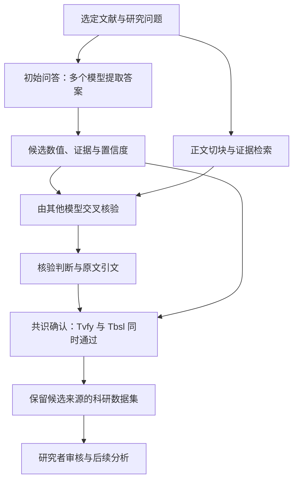

# LUMINA

**简体中文** | [English](README.md)

[](https://github.com/Voss-zeji/LUMINA/actions/workflows/mock-tests.yml)
[](LICENSE)

**LLM Unified Model Integration for Nullifying AI Hallucination**

LUMINA 是用于定量科学综合的多模型框架。它结合文献结构化抽取、支持证据的交叉核验和模型共识确认，减少无依据的模型输出，构建可追溯的科研数据集。

本仓库提供可配置的文献抽取、交叉核验与共识确认流水线。Aqua 和 Wildfire 是内置研究配置，也可仅编辑配置接入新的文本或数值研究主题。

## 1. 科研目的

科学综合需要将数值与其单位、研究背景和实验条件一并提取。LUMINA 以**文献 × 问题 × 模型 × 轮次**组织任务：多个模型分别给出候选回答和原文证据，其他模型核验证据，再对候选结果进行汇总。

结果表保留科学变量、原始文献、模型回答与核验记录之间的对应关系，可用于证据审查、研究数据库构建及后续定量分析。

## 2. 科学框架

论文稿件将方法分为三个阶段：

| 阶段 | 操作 | 结果 |
|---|---|---|
| **初始问答（Initial Query）** | 多个基础模型分别阅读文献并回答指定研究问题 | 候选数值、原文证据和模型自报置信度 |
| **交叉核验（Cross-examination）** | 其他选定模型将引用证据与原文检索片段进行比对 | 核验判断及支持引文 |
| **共识确认（Consensus Confirmation）** | 同时满足证据核验与基础模型共识门槛，接受已核验候选中唯一的最高频答案 | 结构化研究记录与候选明细 |



抽取阶段使用保留的完整文章正文。检索用于定位交叉核验的证据：将候选证据向量化，与正文片段匹配，再将匹配片段及相邻上下文提供给核验模型。

仓库中的核验任务检查证据是否存在及是否与主题相关。生成模型不参与自身候选的核验。选择 M 个抽取模型时，`cross_score` 统计其他模型的支持票，最高为 **M − 1**；`min_cross_scores` 设置核验阈值，`ensemble` 对相应候选进行标准化与汇总。

共识确认要求**两个条件同时满足**：支持候选的核验票达到 `min_cross_scores`（T_vfy）；其标准化答案是已核验候选中唯一的最高频答案，且至少由 `min_consensus_models` 个不同抽取模型共同支持（T_bsl）。同一模型的重复行只计一票；不同指标、单位和明确的实验标识分别判断，并列最高票暂不接受。`MiniCrossNN` 保存正式接受记录与候选判定明细；`00_full` 是未筛选的诊断基线，不代表正式接受的数据集。

## 3. 研究任务与论文案例

稿件以**38 篇论文和 633 个基准问答对**评估温室气体数据提取，与 24 个单独运行的 LLM 和 17 位领域专家比较，主实验采用 7 个选定模型组成集成。

复现案例包括三个土壤无脊椎动物指标：白蚁对植物生物量、蚯蚓对葡萄糖苷酶活性、蚂蚁对土壤电导率的影响，以及海洋动物森林群落的存活率。抽取数据接入原研究的分析流程。

上述设置对应稿件中的研究实验。使用本仓库时，用户自行选择模型，并运行以下领域问题集：

| 领域 | 问题 | 提取内容 |
|---|---|---|
| **Aqua——淡水养殖** | Q1 | 研究地点、地点细节、研究时期、纬度与经度 |
| | Q2 | 养殖物种：fish、shrimp、crab、mixed 或 others |
| | Q3 | 比较试验或不同处理的甲烷通量及单位 |
| **Wildfire——生物质燃烧** | Q1 | 研究地点与研究时期 |
| | Q2–Q4 | CO2、CH4、N2O 排放因子，燃料与燃烧条件、MCE、实验值或文献引用值标记 |

具体问题和输出要求见 [Aqua 配置](configs/aqua/questions.toml)与 [Wildfire 配置](configs/wildfire/questions.toml)。

## 4. 程序流程

科学框架通过六个处理阶段执行：

| 科学步骤 | 程序阶段 | 处理内容 | 产出 |
|---|---|---|---|
| 输入准备 | `prepare` | 使用 Marker 将 PDF 转换为 Markdown，准备文章正文并检查近似 token 数 | Markdown 与准备信息 |
| 初始问答 | `examiner` | 构建文献和问题提示词，调用选定模型，解析结构化回答 | 逐任务回答表与元数据 |
| | `composite` | 合并选定模型在当前轮次的回答 | 按问题组织的 Excel 候选表 |
| 交叉核验 | `embeddings` | 将正文切分为重叠片段并生成向量 | 向量缓存与元数据 |
| | `cross` | 检索证据上下文，调用其他核验模型并汇总判断 | 核验记录与 `cross_score` |
| 共识确认 | `ensemble` | 标准化回答，汇总全量及阈值筛选版本 | 结果表与全部标准化回答表 |

保存的 Markdown 保持完整，下游读取时使用 References、Acknowledgments 或 Appendix 标题之前的正文。默认检索参数为 2,048 字符切块、20% 重叠，并取最佳匹配片段前后各一个相邻片段。

### 使用流程


程序保存输入快照、请求回执及预算记录。批量处理复用试跑已完成的请求；再次运行同一命令可恢复进度。程序完成与独立科学评价分别记录。

## 5. 安装与配置

使用 Python 3.12：

```bash
git clone https://github.com/Voss-zeji/LUMINA.git
cd LUMINA
python -m pip install -r requirements.txt
```

PDF 输入需要另行安装兼容的 `marker-pdf`，并明确允许准备转换资源；Markdown 输入无需该依赖。

复制 `configs/aqua`、`configs/wildfire` 或 `configs/generic` 为自己的研究目录。例如 PowerShell：

```powershell
Copy-Item configs/aqua configs/my-study -Recurse
Copy-Item configs/my-study/secrets.example.toml configs/my-study/secrets.local.toml
```

Bash：

```bash
cp -R configs/aqua configs/my-study
cp configs/my-study/secrets.example.toml configs/my-study/secrets.local.toml
```

| 文件 | 填写内容 |
|---|---|
| `project.toml` | 模型及接口、研究名称、轮次、检索参数、试跑数量、输出位置、模型价格与四项预算 |
| `papers.txt` | 每行一个 PDF 或 Markdown 路径 |
| `questions.toml` | 全部提示词、问题列表、文本／数值类型、字段与单位要求 |
| `secrets.local.toml` | API 密钥；此文件被 Git 忽略 |

所有相对路径以配置目录为基准。示例中的占位内容必须替换为真实设置；模型价格不能猜测。配置读取使用 Python 标准库 `tomllib`，无需新增配置解析依赖。

新增主题时，编辑问题配置中的稳定 `id`、`prompt`、`kind`、`items`、`allowed_values`、`require_unit` 和 `require_experimental`。回答继续使用 `item/value/evidence/confidence_lv` 标量结构，按问题增加 `unit/experimental`；新增算法或嵌套回答结构需要 Python 开发。

## 6. 运行任务

先检查配置，此步骤不调用模型，也不创建运行目录：

```bash
python run_pipeline.py --config configs/my-study/project.toml --check
```

执行或恢复同一研究：

```bash
python run_pipeline.py --config configs/my-study/project.toml
```

第一次执行先完成少量文章。检查显示的 `smoke_report.json`、结果表及原文证据，确认单位和实验归属后，在终端输入 `y` 继续整批。无交互输入时程序暂停；在交互终端重新执行相同命令即可确认，无需查找内部审批编号。

默认 `project.stage = "all"`。改为 `prepare`、`examiner`、`composite`、`embeddings` 或 `cross` 时，执行所需前序步骤并在该阶段完成后暂停；改回 `all` 继续。`ensemble` 完成当前试跑或批量范围的全部科学阶段，试跑确认仍然生效。

相同 `project.run_id` 对应同一次运行。模型、文章、提示词、问题规则、科研参数或预算改变时，应更换运行标识；程序拒绝混用旧结果。`project.stage` 是本次执行的停止位置，可以调整。退出码 0 表示完成或检查成功，2 表示暂停／需要确认，1 表示错误。

`max_runtime` 包含从运行创建起的等待与审核时间。结果未知的模型请求保留费用占用和回执，须核对后处理，不盲目重试。详细记录见输出目录的 `reports/`。

旧 Python 配置入口仍可用，迁移说明见 [配置指南](CONFIGURATION.md)。旧运行目录不会自动改写；规格不兼容时使用原版本恢复或新建运行。需要高级诊断、独立参考集评价或手工请求核对时，见 [高级运行指南](AGENT_GUIDE.md)。

## 7. 结果与数据组织

每条回答包含 `value`、`evidence`、`confidence_lv` 及领域字段。元数据将其关联至文献、问题、模型、轮次和请求；合并表增加基于内容的 `candidate_id`，交叉核验增加模型判断与分数。

- **回答文件**：按模型和问题保存；`.csv` 实际使用制表符分隔（TSV）。
- **候选表**：按问题保留各模型回答、证据及来源。
- **核验记录**：保存每个核验模型的判断及引用原文。
- **结果表**：`00_full` 和配置的 `MiniCrossNN` 版本分别产出 `Ensemble_Result` 与 `Ensemble_All-Standard-Answers`。
- **运行记录**：保留输入快照、冻结配置、请求回执、预算和执行报告。

汇总在单篇文献内规范化元数据、数值和单位字符串。选择后续分析数据时，应同时查看结果表与候选明细。

```text
runs/<run_id>/
  manifest.json       输入、模型、问题与冻结配置
  ledger.sqlite       任务、请求尝试、预算和批准记录
  inputs/             原始文献快照
  outputs/
    prepared/         Markdown 与准备元数据
    R01/
      examiner/       逐任务回答
      composite/      按问题组织的候选表
      embeddings/     向量缓存
      cross/          核验记录与分数
      ensemble/       全量及阈值筛选结果
  checkpoints/        原始响应与阶段回执
  reports/            计划、试跑、最终及状态报告
```

## 8. 项目资料

- [Aqua 配置](configs/aqua/project.toml) · [Wildfire 配置](configs/wildfire/project.toml) · [新主题模板](configs/generic/project.toml)
- [配置参考与迁移说明](CONFIGURATION.md)
- [高级运行与诊断](AGENT_GUIDE.md)
- [独立参考集格式](gold.example.json)

本 Voss fork 基于 [billy31/LUMINA](https://github.com/billy31/LUMINA)，保留 [Apache License 2.0](LICENSE) 开源协议。

---

**简体中文** | [English](README.md)
