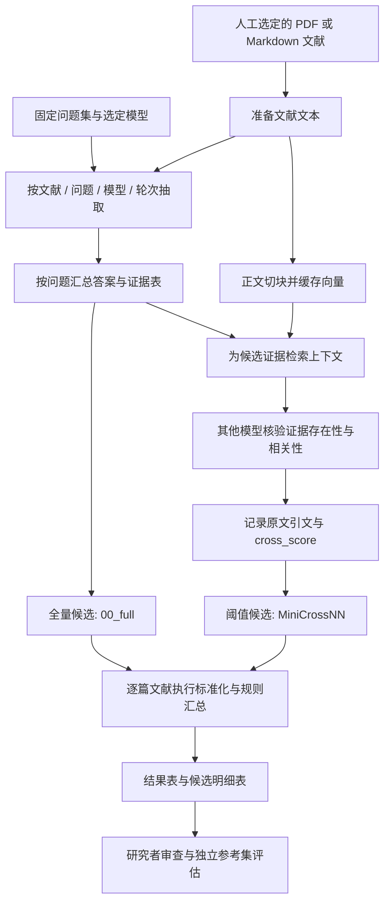
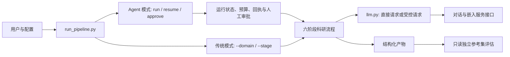
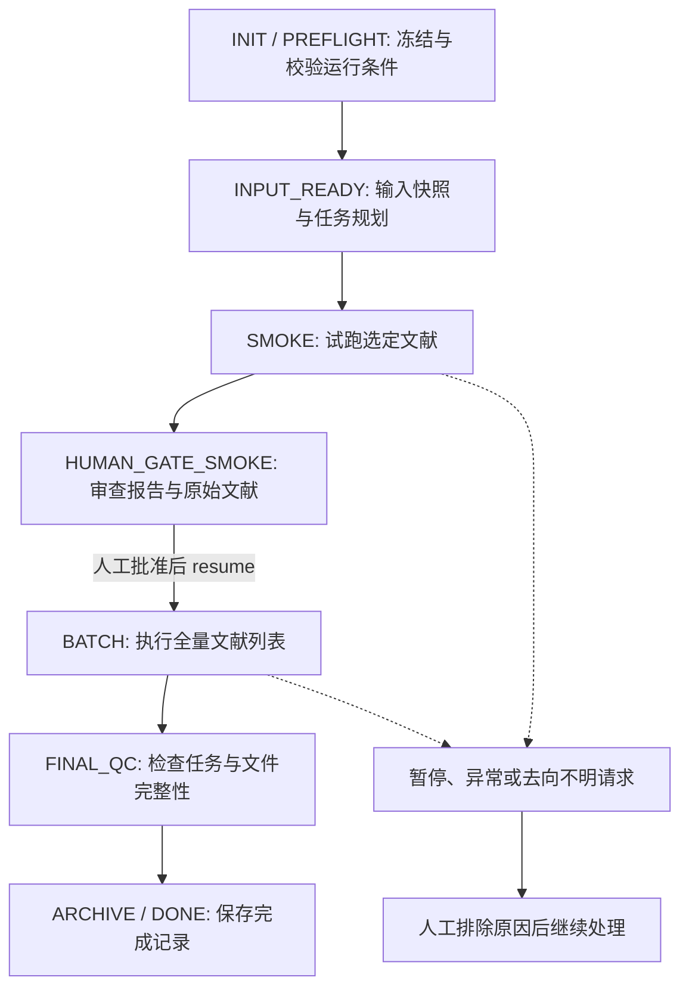

# LUMINA

**简体中文** | [English](README.md)

[](https://github.com/Voss-zeji/LUMINA/actions/workflows/mock-tests.yml)
[](LICENSE)

LUMINA 利用多个大语言模型从学术文献中提取结构化科学证据。此 Voss fork 增加了持久化运行控制、API 预算管理、故障恢复、人工审批与独立参考集评估机制。

官方全称为 **Language-model Unified Meta-analysis with Integrated Numeric Assembly**。当前代码定位为构建文献证据表，**未实现**效应量计算、异质性检验或随机效应模型等统计 Meta 分析。

## 1. 项目用途

LUMINA 面向已自主完成文献检索并明确提取需求的研究人员。它调用多个模型分别阅读每篇文献，保留回答与支撑证据，由其他模型核验该证据是否在正文中存在，最后将候选结果按规则整理为表格供人工审查。

| 已实现能力 | 当前未实现能力 |
|---|---|
| 固定 Aqua 与 Wildfire 问题集 | 自动生成科学问题或自动设计抽取 schema |
| PDF/Markdown 文本准备与逐题结构化抽取 | 文献检索、初筛、或完整的系统评价流程 (PRISMA) |
| 证据上下文检索与跨模型交叉核验 | 对每个数值、单位与实验条件的严格事实判定 |
| 具备来源追溯的文件保存与基于规则的候选汇总 | 效应量计算、统计合并或文献偏倚风险评分 |
| Agent 运行控制与只读独立参考集评估模块 | Web 界面、HTTP API 服务或 Docker 容器部署 |

研究人员负责文献选择、科学定义、独立参考集准备以及最终数据审核。

## 2. 支持的研究任务

抽取问题定义在 [`lumina/prompts.py`](lumina/prompts.py) 中。修改配置中的领域描述不会自动生成新问题。当前不支持自定义或部分选择问题。

| 领域 | 问题编号 | 机器提取目标 |
|---|---|---|
| **Aqua**: 淡水养殖 | Q1 | 研究地点、地点细节、研究时期、纬度、经度 |
| | Q2 | 养殖物种：fish、shrimp、crab、mixed 或 others |
| | Q3 | 比较试验或处理条件下的甲烷通量数值，附带物理单位 |
| **Wildfire**: 生物质燃烧 | Q1 | 研究地点与研究时期 |
| | Q2–Q4 | 按燃料/燃烧条件提取 CO2、CH4 和 N2O 排放因子，附带原文证据、MCE 及 `experimental` 标记 |

Aqua 数值提示词强制要求独立的 `unit` 字段。Wildfire 提示词描述了排放因子单位，但未强制单独设立该字段。Wildfire 的 `experimental` 标记用于区分本研究实验值与文献引用值，并非跨文献全局唯一的实验实体 ID。

## 3. 科研流程



| 阶段 | 执行内容 | 主要产出 |
|---|---|---|
| `prepare` | 转换 PDF（可选 Marker）；读取 Markdown；截取 References / Acknowledgments / Appendix 之前的正文；统计近似 token | Markdown 文本与预处理元数据 |
| `examiner` | 向每个选定模型发送截取后的正文及单个固定问题 | 逐任务回答表与元数据 |
| `composite` | 收集选定模型在当前轮次下的有效回答，保留来源指纹 | 每题一个 Excel 候选总表 |
| `embeddings` | 将正文切块并生成向量嵌入 | `.npy` 向量矩阵与缓存元数据 |
| `cross` | 检索最相似正文块及相邻块；由其他模型核验证据是否存在且相关 | 核验明细、原文引文与分数 |
| `ensemble` | 对无过滤版本与配置的阈值版本分别执行标准化与规则汇总 | 结果表与全部标准化回答表 |

抽取阶段采用 3 条消息（专家角色、正文/输出格式说明、具体问题），大模型接收截断后的整篇正文。保存的 Markdown 文件保留完整正文，下游读取时执行截断。

核验阶段模型接收检索到的局部上下文与候选的 `evidence`，而非完整的“数值-单位-条件”事实断言。提取模型不参与自身候选的核验；其他选定模型返回 `existing_flag`（0/1）与 `direct_quote`。`cross_score` 统计确认存在的票数，在 M 个提取模型下最高为 **M − 1**。它衡量的是证据受文本支撑的程度，而非科学事实绝对准确率。

默认检索使用 2,048 字符切块、20% 重叠率，取最佳匹配块及其前后相邻块各 1 个（最多 3 块，边界处少于 3 块），相关参数可在 `RUN` 中配置。

## 4. 传统与 Agent 运行模式

两套模式共享相同的底层科研算法，但共享核心算法并不保证两套模式在同一模型下获得完全相同的文字回复（受外部 API 随机性等影响）。Agent 模式增加了执行控制层，不替换抽取问题与汇总算法。

| 维度 | 传统模式 | Agent 模式 |
|---|---|---|
| 命令入口 | `--domain` / `--stage` | `run` / `resume` 及控制命令 |
| 文献输入 | `config.py` 中的领域目录 | 显式文献列表，作为快照复制到独立 run |
| 进度追踪 | 检查阶段文件与任务指纹/schema | SQLite 权威状态、任务记录与请求回执 |
| 成本与恢复 | 无 Agent 预算账本 | 冻结预算、持久化响应、去向不明请求核对 |
| 人工审批 | 无强制试跑至批处理放行 | 试跑后审查报告，显式人工批准 |
| 产物路径 | 配置的固定目录 | `runs/<run_id>/outputs/R<round>/` 与 JSON 报告 |





在批准进入批处理前，研究人员应仔细审查试跑报告（`reports/smoke_report.json`）：比对抽样答案与原始文献、核对提取单位与处理条件归属，并检查失败任务、缺失值及实际花费。即便是单篇文献的运行，也会在此门槛挂起。

批处理执行会复用试跑已完成的有效请求。轮次独立保存与汇总，无跨轮合并统计。`approve` 命令仅记录人工审批决定，**不会自动启动计算**，必须显式执行 `resume`。`ARCHIVE` 是工作流完成状态，并非向外部云端上传或发布数据的动作。

## 5. 安装与配置

推荐使用 **Python 3.12**，经 Windows/Linux CI 测试。请在独立 Python 环境中安装现有依赖：

```bash
git clone https://github.com/Voss-zeji/LUMINA.git
cd LUMINA
python -m pip install -r requirements.txt
```

Markdown 文档输入无需安装 PDF 转换器。若输入 PDF，需单独安装具备 `PdfConverter`、`create_model_dict` 和 `text_from_rendered` 兼容 API 的 `marker-pdf`。PDF 转换可能需要模型资源，此时 Agent 规格文件必须显式设置 `allow_pdf_resources: true`。

复制本地配置文件：

**PowerShell**

```powershell
Copy-Item config.example.py config.py
```

**Bash**

```bash
cp config.example.py config.py
```

编辑复制的配置文件：

| 配置项 | 填写内容 |
|---|---|
| `FULL_LLM_POOL` / `SELECTED_KEYS` | 模型全称、provider 归属标识、选定的抽取模型 |
| `LLM_SETTINGS` | API 密钥、chat 的 base URL，以及 `supports_json_mode` |
| `EMBEDDING_MODEL` | 嵌入模型全称/归属与完整 POST 请求 URL；若省略则回退到其 provider 的 URL |
| `RUN` | 轮次、温度、切块大小/重叠率、上下文扩展块数、交叉核验阈值 |
| `DOMAINS` | 领域描述、固定问题编号、传统模式输入输出目录 |

chat 调用 OpenAI 兼容的 `chat.completions`；embedding 使用直接 HTTP POST 请求。未实现原生厂商 SDK 适配，亦不支持自动模型回退（fallback）。若 provider 拒绝 `response_format` 参数，设置 `supports_json_mode=False`。

JSON 模式仅向模型请求 JSON 对象结构，并非强制严格的 JSON Schema 解码。代码依赖 JSON5 解析与字段规则校验。敏感密钥保存在本地 `config.py`，受 Git 忽略保护。模型名称仅为配置示例，不保证外部 API 实际可用。

过滤汇总需至少选择 2 个抽取模型。`min_cross_scores` 每个阈值必须是 1 到 M − 1 之间的整数；双模型示例使用 `[1]`。

## 6. 运行任务

### Agent 模式

复制 [`research.example.json`](research.example.json) 为 `research.json`。填入实际文献路径、模型价格与来源依据、输入输出 token 上限以及四项预算：`max_calls`、`max_tokens`、`max_cost`、`max_runtime`。

模板中的 `null` 和 `REPLACE` 是待填写的占位值，补齐后才能运行。试跑默认选取前 `smoke_size` 篇文献，也可在 `smoke_papers` 中显式指定。诊断 advisor 默认关闭。

生成任务规划（不发起模型请求）：

```bash
python run_pipeline.py run --spec research.json --config config.py --runs-dir runs --run-id study-001 --dry-run
python run_pipeline.py status --runs-dir runs --run-id study-001
```

Dry-run 复制输入快照、冻结运行条件并在 `INPUT_READY` 规划任务，不执行 PDF 转换或大模型抽取。使用同一运行的 `resume` 启动试跑：

```bash
python run_pipeline.py resume --runs-dir runs --run-id study-001 --config config.py
```

审查 `reports/smoke_report.json` 与原始文献。从 `status` 输出中获取待放行的门槛 ID（替换下方的 `GATE_ID` 占位符）：

```bash
python run_pipeline.py approve --runs-dir runs --run-id study-001 --gate-id GATE_ID --reason "Reviewed trial outputs and approved the frozen batch scope"
python run_pipeline.py resume --runs-dir runs --run-id study-001 --config config.py
python run_pipeline.py report --runs-dir runs --run-id study-001
```

`approve` 仅记录决策；`resume` 恢复执行。退出码约定：**2** 表示暂停或等待人工处理；**1** 表示执行错误；**0** 表示命令成功结束。已存在的 run-id 不可静默覆盖。

CLI worker 受到 `max_runtime` 监控，该时间**自运行创建时刻起算**，包含待机、暂停与人工审查耗时。暂停仅阻断后续新请求，无法撤回已发出的远程 HTTP 调用。人工放行不能追加预算或更改已冻结的科研条件。

请求在发出前预留预算，响应先写入持久账本再进行解析。缺失 usage 计为保守上限。去向不明的请求需人工核对，严禁盲目重试。仅可确认未执行的拒绝才允许有限重试；SDK 静默重试已被显式关闭。更多细节参考 [Agent 指南](AGENT_GUIDE.md)。

### 传统模式

将 PDF 或 Markdown 放入配置的领域目录：

```bash
python run_pipeline.py --config config.py --domain aqua --stage all
python run_pipeline.py --config config.py --domain wildfire --stage all
# 单阶段运行（需已有前序产物）：
python run_pipeline.py --config config.py --domain wildfire --stage ensemble
```

阶段可选：`prepare`、`examiner`、`composite`、`embeddings`、`cross`、`ensemble` 与 `all`。传统模式会校验文件来源与指纹，支持续跑，但无 Agent 预算账本或强制试跑审批。异常中断可能留下锁文件，需核实 PID 后再行清理。

## 7. 输入、产物与可追溯性

任务颗粒度为 **文献 × 问题 × 模型 × 轮次**。单次模型响应可能返回多个 item，均包含 `value`、`evidence` 与 `confidence_lv` 及领域字段。系统补入文献/模型/问题/轮次标识、请求/正文指纹、token 统计及耗时。合并表赋予 `candidate_id`；核验赋予 flags 与 `cross_score`。

命名为 `.csv` 的文件实际为**制表符分隔（TSV）**。同一调用的 token 总数会在该次调用的所有 item 行重复出现；直接累加会重复计数，全局用量应以 Agent 请求账本为准。

```text
runs/<run_id>/
  manifest.json                 # 冻结的输入快照与执行条件
  ledger.sqlite                 # 权威状态、任务、请求与审批账本
  inputs/                       # 文献原始输入快照（.md 或 .pdf）
  outputs/
    prepared/                   # 完整 Markdown 正文与预处理元数据
    R01/
      examiner/                 # 逐任务抽取 TSV 与元数据
      composite/                # LUMINA_Q01.xlsx, LUMINA_Q02.xlsx, ...
      embeddings/               # 正文切块向量与缓存元数据
      cross/                    # 核验记录与 cross_scores.xlsx
      ensemble/
        00_full/                # 未过滤汇总结果与候选明细
        MiniCross01/            # 指定核验阈值子集产物
  checkpoints/                  # 原始响应与阶段完整性记录（stages/<task_id前16位>/）
  reports/                      # 规划、试跑、终检与状态 JSON 报告
  state.json / metrics.json     # 导出的状态与指标
  events.jsonl / errors.jsonl   # 导出的事件与错误流
```

每个问题与变体产出 `*_Ensemble_Result_*` 与 `*_Ensemble_All-Standard-Answers_*` 表格。`00_full` 包含全量候选；阈值变体要求候选具有有效的当前核验记录。核验缺失不视为否定票。

汇总仅在单篇文献内部进行文本规范化与数值归并，不进行跨文献统计合并，亦不转换物理单位。数值 `±` 表达式默认取中心数值。当有效规范化数值中，包含两位及以上小数的比例 ≥ 50% 时，现存的跨 item 模式保留数值候选集合，而非保证评出单一胜者。投票计数统计的是候选行数，并不等同于独立大模型数量或独立研究数量。

输入哈希、响应回执与向量缓存支持追溯与断点续跑。修改已冻结的输入或代码需新建 run。这些哈希无法锁定外部库版本、服务端模型版本或 PDF 转换模型权重。

## 8. 科学可靠性与当前限制

工程完成、模型一致与科学结果正确是不同的判断。**`DONE` 状态与通过最终质检（FINAL_QC）并不代表科学正确性**；符合基础校验的全空回答也可以完成流程。

- **证据核验局限**：仅核验证据存在性与相关性，不核查数值或事实断言。正面投票仅验证 `direct_quote` 非空，未在代码层面强制比对正文原文子串。
- **字段与校验漏洞**：初始校验规则不够严格，部分缺失元数据、未声明物种标签或非数值字符串可能绕过校验。置信度为模型自评，未经统计校准。
- **实验身份不完整**：汇总算法未完整保留试验组别标识。Aqua 抽取模板不要求 `experimental` 字段，数值评估模块却依赖它推导实验身份；缺少该字段时结果进入 `UNMATCHED`。模型若额外返回该字段，可以保留，但流程没有保证。Wildfire 的 `True`/`Ref` 标记也不是可靠的独立实验 ID。
- **数值处理策略**：数值汇总默认将字符串精确的 `-1` 视为缺失值丢弃，若真实科学通量恰为 `-1`（如吸收通量）将被过滤。燃烧条件后缀中的 None 与 mixed 可能合并；小数聚合分支可能混合不同条件项。单位规范化非严谨的物理量纲系统。
- **文献覆盖损失**：截断附录/参考文献、PDF 表格解析偏差、图像中的数值、长文注意力稀释以及局部检索召回失败，均可能造成信息遗漏。
- **参考指标局限**：遗漏或无法比对的预测可能不进入召回率分母；部分参考集未覆盖的预测可能计入假阳性（FP）。报告指标时应同时报告可比较比例与未决案例。协议标签不能证明独立人工复核已经完成。

使用在抽取流程之外独立构建的参考集运行评估：

```bash
python run_pipeline.py evaluate --runs-dir runs --run-id study-001 --gold independent-gold.json --output-dir evaluation-study-001
```

评估产物必须指定在生产运行目录之外。[`gold.example.json`](gold.example.json) 提供了人造参考集格式示例。若未提供 `--gold`，评估报告 `NOT_EVALUATED` 且指标为空。人工合成示例和 mock 测试不能证明真实文献提取的科学准确率。

## 9. Voss Fork 的修改与演进

本项目构建于开源基线 [billy31/LUMINA](https://github.com/billy31/LUMINA)。在 fork 启动 Agent 开发前，早期的数据工程修复已合并至上游分支。

| 保留的科研核心 | Voss Fork 新增机制 |
|---|---|
| 固定问题集、提示词、证据支持判定准则 | 冻结的研究规格、文献输入快照、稳定的任务哈希标识 |
| 元数据/数值规则汇总与核验阈值过滤机制 | SQLite 运行状态账本、预算管理、持久化响应回执 |
| 原有数据来源追溯、单位保留与文件原子写入保护 | 试跑审批门槛 (HUMAN_GATE_SMOKE)、暂停/续跑、CLI 进程监控 |
| 传统命令行运行方式 | 结构化 JSON 报告、显式跨任务导入、受限诊断 advisor |
| | 只读独立参考集评估模块及 Windows/Linux 离线自动化测试 |

核心调用点植入了可选的 runtime 钩子（涵盖 `cross_validation`、`examiner`、`llm`、`utils` 及入口文件）。提示词与汇总算法未做重新设计，原有的科学局限依然存在。Advisor 受到严格白名单限制，不能修改科学数值、模型、提示词、阈值、预算或批准人工门槛。

## 10. 文档与代码组织

| 文档 | 作用说明 |
|---|---|
| [Agent 指南](AGENT_GUIDE.md) (中文) | 规格定义、控制命令、预算管理、人工门槛与故障恢复 |
| [工作流说明书](LUMINA_AGENTIC_WORKFLOW.md) (中文) | 科研数据链路与工程控制机制详解 |
| [计划与目标](LUMINA_AGENTIC_PLAN_AND_GOALS.md) (中文) | 软件交付证据与待开展的真实文献验收说明 |
| [Agent 审查报告](AGENT_REVIEW.md) / [验证回执](AGENT_VALIDATION.json) | 历史软件功能验证记录 |
| [早期修复报告](FIX_REPORT.md) | Fork 前的数据与工程修复记录 |

软件工程交付已记录完成；真实文献的科学验收仍待推进。历史验证回执仅代表对应提交版本，不代表未来任意状态。

核心代码导航：[`run_pipeline.py`](run_pipeline.py)（主入口）、[`preparation`](lumina/preparation.py)（文献处理）、[`prompts`](lumina/prompts.py)/[`examiner`](lumina/examiner.py)（抽取执行）、[`llm`](lumina/llm.py)（网络适配）、[`composite`](lumina/composite.py)/[`cross_validation`](lumina/cross_validation.py)/[`ensemble`](lumina/ensemble.py)（候选处理与规则汇总）、[`agent`](lumina/agent)（运行控制层）、[`evaluation`](lumina/evaluation.py)（参考集比较）。

## 11. 测试与开源协议

在仓库根目录下运行测试前，必须显式开启离线防护环境变量以阻断网络：

**PowerShell**

```powershell
$env:LUMINA_TEST_OFFLINE = "1"
$env:PYTHONPATH = "tests"
python -B -m unittest discover -s tests -v
```

**Bash**

```bash
LUMINA_TEST_OFFLINE=1 PYTHONPATH=tests python -B -m unittest discover -s tests -v
```

当前测试套件包含 365 项测试，覆盖回归测试、文件处理、SQLite 状态、预算核销、进程控制、报告生成与独立评估。[CI](.github/workflows/mock-tests.yml) 在 Windows/Linux 环境使用 Python 3.12 运行测试与基础 Ruff 检查。外部模型/PDF 边界使用 mock；测试通过不代表真实服务商兼容性或真实文献提取准确率。

LUMINA 采用 [Apache License 2.0](LICENSE) 开源协议，完整保留上游项目归属与版权许可。

---

**简体中文** | [English](README.md)
