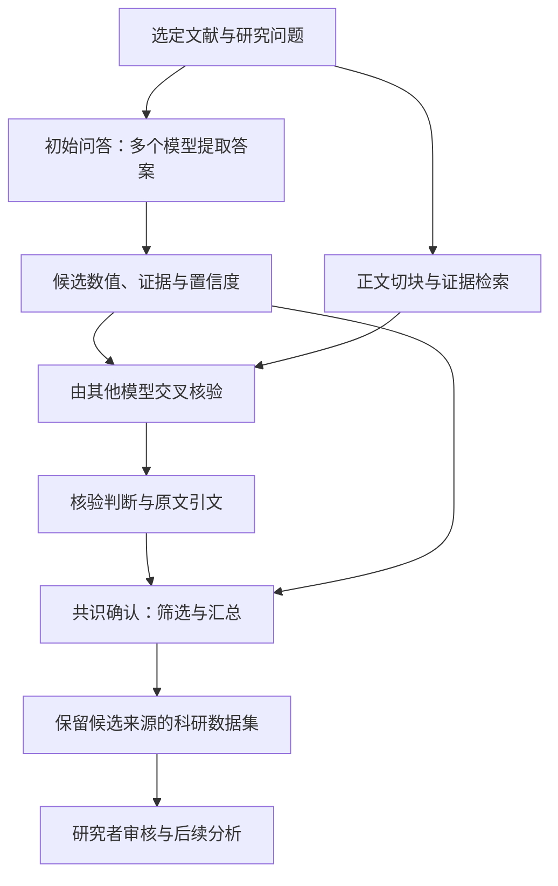

# LUMINA

**简体中文** | [English](README.md)

[](https://github.com/Voss-zeji/LUMINA/actions/workflows/mock-tests.yml)
[](LICENSE)

**LLM Unified Model Integration for Nullifying AI Hallucination**

LUMINA 是用于定量科学综合的多模型框架。它结合文献结构化抽取、支持证据的交叉核验和模型共识确认，减少无依据的模型输出，构建可追溯的科研数据集。

本仓库提供 Aqua 和 Wildfire 科研流程，以及 Voss Agent 运行模式。

## 1. 科研目的

科学综合需要将数值与其单位、研究背景和实验条件一并提取。LUMINA 以**文献 × 问题 × 模型 × 轮次**组织任务：多个模型分别给出候选回答和原文证据，其他模型核验证据，再对候选结果进行汇总。

结果表保留科学变量、原始文献、模型回答与核验记录之间的对应关系，可用于证据审查、研究数据库构建及后续定量分析。

## 2. 科学框架

论文稿件将方法分为三个阶段：

| 阶段 | 操作 | 结果 |
|---|---|---|
| **初始问答（Initial Query）** | 多个基础模型分别阅读文献并回答指定研究问题 | 候选数值、原文证据和模型自报置信度 |
| **交叉核验（Cross-examination）** | 其他选定模型将引用证据与原文检索片段进行比对 | 核验判断及支持引文 |
| **共识确认（Consensus Confirmation）** | 按证据支持程度筛选，并根据模型间的一致性汇总候选 | 结构化研究记录与候选明细 |



抽取阶段使用保留的完整文章正文。检索用于定位交叉核验的证据：将候选证据向量化，与正文片段匹配，再将匹配片段及相邻上下文提供给核验模型。

仓库中的核验任务检查证据是否存在及是否与主题相关。生成模型不参与自身候选的核验。选择 M 个抽取模型时，`cross_score` 统计其他模型的支持票，最高为 **M − 1**；`min_cross_scores` 设置核验阈值，`ensemble` 对相应候选进行标准化与汇总。

稿件将证据支持与基础模型共识作为两个控制维度。仓库保留核验分数、候选频次和模型标识，便于检查每一步的筛选与汇总依据。

## 3. 研究任务与论文案例

稿件以**38 篇论文和 633 个基准问答对**评估温室气体数据提取，与 24 个单独运行的 LLM 和 17 位领域专家比较，主实验采用 7 个选定模型组成集成。

复现案例包括三个土壤无脊椎动物指标：白蚁对植物生物量、蚯蚓对葡萄糖苷酶活性、蚂蚁对土壤电导率的影响，以及海洋动物森林群落的存活率。抽取数据接入原研究的分析流程。

上述设置对应稿件中的研究实验。使用本仓库时，用户自行选择模型，并运行以下领域问题集：

| 领域 | 问题 | 提取内容 |
|---|---|---|
| **Aqua——淡水养殖** | Q1 | 研究地点、地点细节、研究时期、纬度与经度 |
| | Q2 | 养殖物种：fish、shrimp、crab、mixed 或 others |
| | Q3 | 比较试验或不同处理的甲烷通量及单位 |
| **Wildfire——生物质燃烧** | Q1 | 研究地点与研究时期 |
| | Q2–Q4 | CO2、CH4、N2O 排放因子，燃料与燃烧条件、MCE、实验值或文献引用值标记 |

具体问题和输出要求见 [`lumina/prompts.py`](lumina/prompts.py)。

## 4. 程序流程

科学框架通过六个处理阶段执行：

| 科学步骤 | 程序阶段 | 处理内容 | 产出 |
|---|---|---|---|
| 输入准备 | `prepare` | 使用 Marker 将 PDF 转换为 Markdown，准备文章正文并检查近似 token 数 | Markdown 与准备信息 |
| 初始问答 | `examiner` | 构建文献和问题提示词，调用选定模型，解析结构化回答 | 逐任务回答表与元数据 |
| | `composite` | 合并选定模型在当前轮次的回答 | 按问题组织的 Excel 候选表 |
| 交叉核验 | `embeddings` | 将正文切分为重叠片段并生成向量 | 向量缓存与元数据 |
| | `cross` | 检索证据上下文，调用其他核验模型并汇总判断 | 核验记录与 `cross_score` |
| 共识确认 | `ensemble` | 标准化回答，汇总全量及阈值筛选版本 | 结果表与全部标准化回答表 |

保存的 Markdown 保持完整，下游读取时使用 References、Acknowledgments 或 Appendix 标题之前的正文。默认检索参数为 2,048 字符切块、20% 重叠，并取最佳匹配片段前后各一个相邻片段。

### 传统模式与 Agent 模式

两种模式调用同一套科研流程。

| | 传统模式 | Voss Agent 模式 |
|---|---|---|
| 入口 | `--domain` / `--stage` | `run`、`resume` 及控制命令 |
| 输入 | `config.py` 中的领域目录 | 显式文献列表与独立输入快照 |
| 进度 | 阶段文件与任务指纹 | 持久化 SQLite 状态、任务与请求回执 |
| 执行 | 指定阶段或完整流程 | 试跑、人工批准、批量执行与最终完整性检查 |
| 成本记录 | 输出中的请求信息 | 调用次数、token、费用、运行时间预算及请求账本 |
| 输出 | 配置的领域目录 | `runs/<run_id>/outputs/R<round>/` 与 JSON 报告 |


Agent 在批量阶段复用试跑已完成的请求，各轮次分别保存结果。试跑审核时，研究者检查原文证据、单位、处理归属及费用，再决定是否继续。工程完成状态与独立科学评价分别记录。

## 5. 安装与配置

使用 Python 3.12 和独立环境：

```bash
git clone https://github.com/Voss-zeji/LUMINA.git
cd LUMINA
python -m pip install -r requirements.txt
```

输入 PDF 时，安装提供 `PdfConverter`、`create_model_dict`、`text_from_rendered` 接口的兼容 `marker-pdf` 版本；也可直接提供 Markdown。

复制配置模板：

```powershell
# PowerShell
Copy-Item config.example.py config.py
```

```bash
# Bash
cp config.example.py config.py
```

| 配置项 | 填写内容 |
|---|---|
| `FULL_LLM_POOL` / `SELECTED_KEYS` | 模型名称、服务来源与选定的抽取模型 |
| `LLM_SETTINGS` | API 密钥、chat base URL 与 `supports_json_mode` |
| `EMBEDDING_MODEL` | 嵌入模型、服务来源与完整 embedding 请求 URL |
| `RUN` | 轮次、温度、切块大小及重叠率、上下文扩展、核验阈值 |
| `DOMAINS` | 领域描述、问题编号及传统模式的输入输出目录 |

chat 使用 OpenAI 兼容的 `chat.completions` 接口，embedding 使用直接 HTTP POST。`supports_json_mode=True` 请求 JSON 对象，随后由 JSON5 解析器和本地字段规则处理。密钥保存在被 Git 忽略的本地 `config.py` 中。

选择 M 个抽取模型时，每个核验阈值应在 1 到 M − 1 之间。双模型示例使用 `min_cross_scores: [1]`。

## 6. 运行任务

### 传统科研流程

将文献放入配置的领域目录后运行：

```bash
python run_pipeline.py --config config.py --domain aqua --stage all
python run_pipeline.py --config config.py --domain wildfire --stage all
```

已有前序产物时，可以选择单个阶段：

```bash
python run_pipeline.py --config config.py --domain wildfire --stage ensemble
```

### Agent 执行

复制 [`research.example.json`](research.example.json) 为 `research.json`，填写文献路径、轮次、试跑文献、模型价格及依据、token 上限，以及 `max_calls`、`max_tokens`、`max_cost`、`max_runtime` 四项预算，替换模板中的 `null` 和 `REPLACE`。需要准备 PDF 模型资源时，设置 `allow_pdf_resources: true`。

创建运行并查看计划，此步骤不发送模型请求：

```bash
python run_pipeline.py run --spec research.json --config config.py --runs-dir runs --run-id study-001 --dry-run
python run_pipeline.py status --runs-dir runs --run-id study-001
```

继续同一次运行，执行试跑：

```bash
python run_pipeline.py resume --runs-dir runs --run-id study-001 --config config.py
```

审核 `reports/smoke_report.json` 和原始文献，从 `status` 读取待批准的 gate ID，并替换下方 `GATE_ID`：

```bash
python run_pipeline.py approve --runs-dir runs --run-id study-001 --gate-id GATE_ID --reason "Reviewed trial evidence, outputs, and costs"
python run_pipeline.py resume --runs-dir runs --run-id study-001 --config config.py
python run_pipeline.py report --runs-dir runs --run-id study-001
```

`approve` 记录批准决定，`resume` 继续执行。退出码 2 表示暂停或需要人工处理。`max_runtime` 从运行创建时开始计算，包含等待与审核时间。响应先记录后解析，执行结果不确定的请求保留供人工核对。暂停、恢复和请求控制详见 [Agent 指南](AGENT_GUIDE.md)。

与独立准备的参考集比较：

```bash
python run_pipeline.py evaluate --runs-dir runs --run-id study-001 --gold independent-gold.json --output-dir evaluation-study-001
```

评价器在生产运行目录之外写入结果，参考格式见 [`gold.example.json`](gold.example.json)。

## 7. 结果与数据组织

每条回答包含 `value`、`evidence`、`confidence_lv` 及领域字段。元数据将其关联至文献、问题、模型、轮次和请求；合并表增加基于内容的 `candidate_id`，交叉核验增加模型判断与分数。

- **回答文件**：按模型和问题保存；`.csv` 实际使用制表符分隔（TSV）。
- **候选表**：按问题保留各模型回答、证据及来源。
- **核验记录**：保存每个核验模型的判断及引用原文。
- **结果表**：`00_full` 和配置的 `MiniCrossNN` 版本分别产出 `Ensemble_Result` 与 `Ensemble_All-Standard-Answers`。
- **Agent 记录**：保留输入快照、冻结配置、请求回执、预算和执行报告。

汇总在单篇文献内规范化元数据、数值和单位字符串。选择后续分析数据时，应同时查看结果表与候选明细。

```text
runs/<run_id>/
  manifest.json       输入、模型、问题与冻结配置
  ledger.sqlite       任务、请求尝试、预算和批准记录
  inputs/             原始文献快照
  outputs/
    prepared/         Markdown 与准备元数据
    R01/
      examiner/       逐任务回答
      composite/      按问题组织的候选表
      embeddings/     向量缓存
      cross/          核验记录与分数
      ensemble/       全量及阈值筛选结果
  checkpoints/        原始响应与阶段回执
  reports/            计划、试跑、最终及状态报告
```

## 8. 项目资料

- [抽取提示词与领域问题](lumina/prompts.py)
- [模型及目录配置示例](config.example.py)
- [Agent 研究规格示例](research.example.json)
- [Agent 操作指南](AGENT_GUIDE.md)
- [科研流程与 Agent 工作流](LUMINA_AGENTIC_WORKFLOW.md)

本 Voss fork 基于 [billy31/LUMINA](https://github.com/billy31/LUMINA)，保留 [Apache License 2.0](LICENSE) 开源协议。

---

**简体中文** | [English](README.md)
